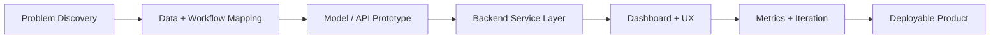

<div align="center">


<p>
  <a href="mailto:crispin.theofficial@gmail.com">
    
  </a>
  <a href="https://www.linkedin.com/in/crispin-theophane">
    
  </a>
  <a href="https://github.com/kip23theo?tab=followers">
    
  </a>
  
</p>

<p>
  
  
  
  
  
  
  
  
</p>

</div>

---

## `SYSTEM.IDENTITY`

```yaml
user: Crispin Theophane
location: Bengaluru, India
role: AI/ML Engineer in Training | Full-Stack Developer
education: B.Tech Electronics & Computer Engineering, CHRIST University
graduation: May 2027
gpa: 3.43 / 4.0
current_build: Career Copilot
operating_mode: product-first, backend-aware, analytics-driven
```

```txt
MISSION
Build intelligent systems that move cleanly from model experiments
to reliable APIs, usable dashboards, and production workflows.
```

<div align="center">

| `AI_AGENTS` | `RAG_SYSTEMS` | `BACKEND_ARCHITECTURE` | `ML_DEPLOYMENT` | `FULL_STACK_PRODUCTS` |
| --- | --- | --- | --- | --- |
| Building | Exploring | Improving | Optimizing | Shipping |

</div>

---

## `ENGINEERING.CONSOLE`

<table>
  <tr>
    <td width="50%" valign="top">

### `runtime.profile`

```txt
LANGUAGE_CORE   Python, JavaScript, TypeScript, C
BACKEND_CORE    FastAPI, Django REST Framework, Node.js, Express
FRONTEND_CORE   React, Next.js, HTML, CSS
DATA_LAYER      PostgreSQL, MongoDB, MySQL, Redis
AI_LAYER        scikit-learn, OpenVINO, Pandas, NumPy, NLP
DELIVERY        Docker, Git, Postman, AWS foundations
```

  </td>
  <td width="50%" valign="top">

### `focus.queue`

```txt
01  AI agents for practical workflows
02  Retrieval-augmented generation systems
03  Production-grade full-stack AI products
04  Backend architecture and system design
05  Scalable ML inference and deployment
```

  </td>
  </tr>
</table>

<div align="center">


</div>

---

## `BUILD.PIPELINE`



---

## `PROJECTS.FEATURED`

<table>
  <tr>
    <td width="50%" valign="top">

### `career-copilot`

```txt
TYPE      AI career analytics platform
STACK     FastAPI, MongoDB, React
FEATURES  ATS analysis, skill gaps, roadmaps
STATUS    Active build
```

  </td>
  <td width="50%" valign="top">

### `ai-order-fulfillment`

```txt
TYPE      Operations intelligence system
STACK     Django, PostgreSQL, Redis, Celery
FEATURES  Routing, delay prediction, KPI dashboards, RBAC
STATUS    Internship product build
```

  </td>
  </tr>
  <tr>
    <td width="50%" valign="top">

### `twitter-sentiment-analysis`

```txt
TYPE      NLP classification pipeline
STACK     Python, TF-IDF, Logistic Regression, Naive Bayes
DATA      50K+ tweets
METRICS   Precision, recall, F1
```

  </td>
  <td width="50%" valign="top">

### `cognitive-games`

```txt
TYPE      Brain-training web platform
STACK     React, APIs, analytics
FEATURES  Progressive difficulty, performance tracking
GOAL      Measurable cognitive progression
```

  </td>
  </tr>
</table>

---

## `EXPERIENCE.LOG`

| Runtime | Node | Execution Trace |
| --- | --- | --- |
| `Apr 2026 - May 2026` | `TCS BFSI Garage / Developer Intern` | Built AI-powered fulfillment flows, Django REST APIs, PostgreSQL/Redis/Celery services, KPI dashboards, and RBAC authentication. |
| `Dec 2025 - Feb 2026` | `Emertxe / Full Stack Developer Intern` | Developed Node.js and Express APIs, JWT auth, MongoDB integrations, and frontend-backend connectivity. |
| `May 2025 - Jul 2025` | `Intel Unnati / Project Intern` | Optimized OpenVINO IR workflows, benchmarked latency, and achieved a 25% CPU inference performance boost. |

---

## `GITHUB.TELEMETRY`

<div align="center">


<br />
<br />


<br />
<br />


</div>

---

## `CERTIFICATIONS.REGISTRY`

| Certification | Issuer | Status |
| --- | --- | --- |
| Cloud Foundations | AWS Academy | `verified` |
| Generative AI Foundations | AWS Academy | `verified` |
| Data Science for Engineers | NPTEL | `verified` |
| Getting Started with Data | IBM | `verified` |
| Machine Learning & Deep Learning | MathWorks | `verified` |

---

## `ACHIEVEMENTS.UNLOCKED`

<div align="center">


</div>

| Channel | Highlights |
| --- | --- |
| `leadership` | Google Gemini Student Ambassador, IEEE Leadership Contributor |
| `competitions` | 2x Hackathon Winner, Smart India Hackathon participant |
| `community` | Open-source collaboration, CODEX participant, hackathon contributor |

---

## `OPEN_TO.CONNECT`

```txt
> AI/ML internships
> Full-stack engineering roles
> Backend development opportunities
> Hackathon and startup product builds
> Open-source AI/backend collaborations
```

<div align="center">


<br />
<br />

<a href="mailto:crispin.theofficial@gmail.com">
  
</a>
<a href="https://www.linkedin.com/in/crispin-theophane">
  
</a>

<br />
<br />


</div>
