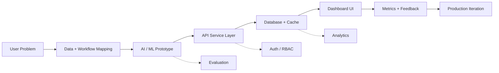

<div align="center">


<h3>AI/ML Engineer in Training | Full-Stack Developer | Product-Focused Backend Builder</h3>

<p>
  
  
  
</p>

<p>
  <a href="mailto:crispin.theofficial@gmail.com">
    
  </a>
  <a href="https://www.linkedin.com/in/crispin-theophane">
    
  </a>
  <a href="https://github.com/kip23theo?tab=followers">
    
  </a>
  
</p>

<p>
  
  
  
  
</p>

</div>

---

## `GITHUB.TELEMETRY`

<div align="center">

<!-- FIX 1: streak URL replaced | FIX 6: wrapped in anchor tag -->
<a href="https://github.com/kip23theo">
  
</a>
<!-- FIX 3: main stats card added | FIX 2: cache_seconds=1800 | FIX 6: wrapped in anchor tag -->
<a href="https://github.com/kip23theo">
  
</a>

<br />
<br />

<!-- FIX 2: cache_seconds=1800 | FIX 6: wrapped in anchor tag -->
<a href="https://github.com/kip23theo">
  
</a>

<br />
<br />

<!-- FIX 6: wrapped in anchor tag -->
<a href="https://github.com/kip23theo">
  
</a>

<br />
<br />

<!-- FIX 6: wrapped in anchor tags -->
<a href="https://github.com/kip23theo">
  
</a>
<a href="https://github.com/kip23theo">
  
</a>

<br />
<br />

<!-- FIX 6: wrapped in anchor tag -->
<a href="https://github.com/kip23theo">
  
</a>

</div>

---

## `COMMAND.CENTER`

### `system.identity`

```yaml
user: Crispin Theophane
location: Bengaluru, India
role: AI/ML Engineer in Training | Full-Stack Developer
education: B.Tech Electronics & Computer Engineering
university: CHRIST University
graduation: May 2027
gpa: 3.43 / 4.0
current_build: Career Copilot
```

### `mission.statement`

```txt
Build intelligent systems that move cleanly
from model experiments to reliable APIs,
usable dashboards, and production workflows.

Primary style:
product-first | backend-aware | analytics-driven
```

<div align="center">

| `AI_AGENTS` | `RAG_SYSTEMS` | `BACKEND_ARCHITECTURE` | `ML_DEPLOYMENT` | `FULL_STACK_AI` |
| --- | --- | --- | --- | --- |
| Building | Exploring | Improving | Optimizing | Shipping |

</div>

---

## `FEATURE.FLAGS`

<div align="center">


</div>

<br />

<div align="center">

<!-- FIX 7: replaced 'c' with 'linux' (sklearn not supported by skillicons) -->


</div>

---

## `ENGINEERING.MATRIX`

| Layer | Tools | What I Build |
| --- | --- | --- |
| `ai_ml` | Python, scikit-learn, OpenVINO, Pandas, NumPy | NLP pipelines, inference optimization, model evaluation |
| `api_backend` | FastAPI, Django REST Framework, Node.js, Express | Auth, RBAC, async jobs, service APIs |
| `frontend` | React, Next.js, TypeScript | Dashboards, product flows, API-connected interfaces |
| `data` | PostgreSQL, MongoDB, MySQL, Redis | Schemas, caching, analytics-ready storage |
| `deployment` | Docker, Git, Postman, AWS foundations | Reproducible builds, API testing, cloud-ready workflows |

---

## `PRODUCT.ARCHITECTURE`



---

## `PROJECT.MODULES`

<table>
  <tr>
    <td width="50%" valign="top">

### `career-copilot.ai`

```txt
TYPE      AI career analytics platform
STACK     FastAPI, MongoDB, React
FEATURES  ATS resume analysis
          skill gap detection
          personalized roadmaps
STATUS    Active build
```

  </td>
  <td width="50%" valign="top">

### `order-fulfillment.ai`

```txt
TYPE      Operations intelligence platform
STACK     Django, PostgreSQL, Redis, Celery
FEATURES  intelligent routing
          delay prediction
          KPI dashboards
          RBAC authentication
STATUS    Completed
```

  </td>
  </tr>
  <tr>
    <td width="50%" valign="top">

### `sentiment-pipeline.nlp`

```txt
TYPE      NLP classification pipeline
STACK     Python, TF-IDF, Logistic Regression, Naive Bayes
DATA      50K+ tweets
METRICS   precision, recall, F1
```

  </td>
  <td width="50%" valign="top">

### `cognitive-games.web`

```txt
TYPE      Brain-training platform
STACK     React, APIs, analytics
FEATURES  progressive difficulty
          performance tracking
          real-time feedback
```

  </td>
  </tr>
</table>

---

## `EXPERIENCE.TIMELINE`

| Runtime | Node | Execution Trace |
| --- | --- | --- |
| `Apr 2026 - May 2026` | `TCS BFSI Garage / Developer Intern` | Built AI-powered fulfillment workflows, Django REST APIs, PostgreSQL/Redis/Celery services, KPI dashboards, and RBAC authentication. |
| `Dec 2025 - Feb 2026` | `Emertxe / Full Stack Developer Intern` | Developed Node.js and Express APIs, JWT auth, MongoDB integrations, and frontend-backend connectivity. |
| `May 2025 - Jul 2025` | `Intel Unnati / Project Intern` | Optimized OpenVINO IR workflows, benchmarked latency, and achieved a 25% CPU inference performance boost. |

---

## `ROADMAP.NEXT`

```txt
[x] Build strong backend fundamentals
[x] Ship internship-grade product systems
[x] Optimize AI inference with OpenVINO
[ ] Build agentic workflows with production guardrails
[ ] Deploy RAG systems with evaluation pipelines
[ ] Publish more open-source AI/backend projects
```

---

## `CERTIFICATIONS.REGISTRY`

| Certification | Issuer | Status |
| --- | --- | --- |
| Cloud Foundations | AWS Academy | `verified` |
| Generative AI Foundations | AWS Academy | `verified` |
| Data Science for Engineers | NPTEL | `verified` |
| Getting Started with Data | IBM | `verified` |
| Machine Learning & Deep Learning | MathWorks | `verified` |

---

## `ACHIEVEMENTS.UNLOCKED`

<div align="center">

<!-- FIX 4: trophy column reduced from 7 to 6 -->


</div>

| Channel | Highlights |
| --- | --- |
| `leadership` | Google Gemini Student Ambassador, IEEE Leadership Contributor |
| `competitions` | 2x Hackathon Winner, Smart India Hackathon participant |
| `community` | Open-source collaboration, CODEX participant, hackathon contributor |

---

## `CONNECT.INTERFACE`

```txt
ACCEPTING
> AI/ML internships
> Full-stack engineering roles
> Backend development opportunities
> Hackathon and startup product builds
> Open-source AI/backend collaborations
```

<div align="center">


<br />
<br />

<a href="mailto:crispin.theofficial@gmail.com">
  
</a>
<a href="https://www.linkedin.com/in/crispin-theophane">
  
</a>

<br />
<br />


</div>
